# ⚡ AETHER AI — Autonomous Enterprise Intelligence

[](https://github.com/Souharda6996/AETHER-AI-Frontend-Proj/stargazers)
[](https://aether-ai-pro.vercel.app/)
[](https://opensource.org/licenses/MIT)


**AETHER AI** is the first autonomous enterprise agent built for high-performance spatial workflows. Engineered with a **47ms P95 latency** and zero-trust security architecture, Aether deploys intelligent, self-correcting agents that scale with your infrastructure.

---

## 🚀 Live Demo
Experience Aether AI in action: **[aether-ai-pro.vercel.app](https://aether-ai-pro.vercel.app/)**

---


## 💎 Premium Experience
The frontend is designed with a **"High-End Spatial"** aesthetic, featuring:
- **Interactive 3D Environments**: Cards and elements that tilt and respond to mouse movements.
- **Dynamic Glare & Shimmer**: Premium glassmorphism with real-time lighting effects.
- **Ultra-Responsive Layout**: Optimized for desktop, tablet, and mobile with seamless transitions.

---

## 🛠️ Technology Stack

| Category | Tools & Technologies |
| :--- | :--- |
| **Frontend Core** |    |
| **Styling & UI** |    |
| **State & Data** |   |
| **Icons & Media** |   |
| **Testing** |   |

---

## 🏗️ System Architecture: The Neural Stack

Aether operates on a modular, multi-layer architecture designed for maximum reliability and minimum latency.

```mermaid
graph TD
    subgraph "Client Layer"
        User((User)) --> Web[Web Interface]
        User --> API[Omnichannel API]
    end

    subgraph "Inference Mesh"
        Web --> Ingest[Input Layer]
        API --> Ingest
        Ingest --> LLM[LLM Core: Transformer Reasoning]
    end

    subgraph "Data & Logic"
        LLM --> Memory[Memory Store: Vector DB]
        LLM --> Tools[Tool Orchestrator]
        Tools --> Security[Security Mesh: Zero Trust]
    end

    subgraph "Delivery"
        Security --> Out[Edge Delivery: Global CDN]
        Memory --> Out
    end

    style Ingest fill:#1a1a1a,stroke:#00BAE0,stroke-width:2px
    style LLM fill:#1a1a1a,stroke:#8B5CF6,stroke-width:2px
    style Memory fill:#1a1a1a,stroke:#00BAE0,stroke-width:2px
    style Out fill:#1a1a1a,stroke:#8B5CF6,stroke-width:2px
```



---

## 🚀 Key Features

- **Autonomous Reasoning**: Multi-step chains that resolve complex queries without human intervention.
- **47ms Edge Inference**: Distributed inference mesh for globally consistent response times.
- **Enterprise Security**: SOC2 Type II compliance with end-to-end encryption.
- **Omnichannel Deploy**: One configuration for Web, Mobile, Slack, Teams, and WhatsApp.
- **Conversational Memory**: High-fidelity context retention across indefinite session lengths.

---

## 💻 Getting Started

### Prerequisites
- Node.js (v18 or higher)
- npm or pnpm

### Installation

1. **Clone the repository:**
   ```bash
   git clone https://github.com/Souharda6996/AETHER-AI-Frontend-Proj.git
   cd AETHER-AI-Frontend-Proj
   ```

2. **Install dependencies:**
   ```bash
   npm install
   ```

3. **Start the development server:**
   ```bash
   npm run dev
   ```

4. **Build for production:**
   ```bash
   npm run build
   ```

---

## 📄 License
Distributed under the MIT License. See `LICENSE` for more information.

---

<p align="center">
  Built with ❤️ by SOUHARDA MANDAL.
</p>
